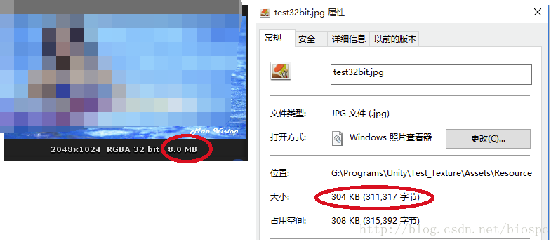

# 纹理格式与文件格式的区别

明明是两张一样的图片为什么大小差别却那么大？ 
原因得从jpg,png和RGBA32以及原生图片纹理的区别说起。 
为了容易区分我们引用三个名词： 
纹理格式———->代表 原生图片纹理 
文件格式———->代表 jpg,png 
压缩纹理格式—–>代表 RGBA32，等等我们在Untiy中可以看到的纹理

其实上述名词本身就已经说明了真相了，这里在解释多一点

纹理格式 
这种格式是图片原生的纹理，图片有多大它就是多大 且 能够被GPU直接处理过的 
常见的纹理格式是：R5G6B5，A4R4G4B4，A1R5G5B5，R8G8B8, A8R8G8B8

文件格式 
所有储存在硬盘中的JPG,PNG等图片，其实都是跟zip,rar一样的东西来的。 
zip,rar是什么东西，就是压缩包；而JPG,PNG也是图片特有的压缩包，是为了便于传输和缩小占用压缩空间所诞生的图片特有的压缩方法 
但是这种JPG,PNG等压缩算法是不能够被GPU识别的，必须得解压缩以后才能够被GPU识别（解压缩后就是纹理格式了）

压缩纹理格式 
这个理解起来比较蛋疼，因为已经有压缩格式和纹理格式了，为什么还要增加一个压缩纹理格式。

首先压缩格式是不能够被GPU直接识别的，在渲染前都得先要解压缩成纹理格式后才能够被GPU识别，在移动平台上的游戏解压缩时间太长了，而且每个游戏都会大量使用图片，所以在移动平台上使用压缩格式的图片是不被接受的。

其次纹理格式中 R5G6B5，A4R4G4B4，A1R5G5B5每个像素占用2个字节，R8G8B8每个像素占用3个字节，A8R8G8B8每个像素占用 4个字节。也就是说对于一张512*512的纹理的话，R5G6B5格式的文件需要占用512KB的容量，A8R8G8B8格式的文件需要占用1MB的容量；如果是 1024*1024的纹理，则各需要2M和4M的容量，这对于动辄需要几十、几百张甚至更多纹理的游戏，上G容量的游戏在移动平台上是不被接受的。

那么有没有其他办法，既能表现丰富的色彩和细节，又能是最小失真的情况下，达到更小的纹理容量呢，还能够GPU识别和读取的纹理。这就是： 压缩纹理格式

# 常见的压缩纹理格式
移动平台上常用的压缩纹理格式有 : RGBA32,RGBA16,ETC1,ETC2,PV4
RGBA32：32bits 带alpha通道的真色彩，理解成原图就对了，图片质量最高档
RGBA16：16bits 带alpha通道的16级色彩，图片质量中档。需要进行抖动处理。
ETC1：4bits 不带alpha通道的, 图片质量最低。且使用于android机型
ETC2：etc1 + alpha 的版本，需要Open gl 3.0 支持
PVRTC4 ：4bits 带alpha通道，图片质量最低。且使用于iphone机型

# 硬件需求
RGBA32和RGBA16的压缩纹理格式是通用的，基本上所有的机型都支持这两种压缩纹理格式
ETC1是在android平台上Open gl 2.0就被支持的压缩纹理格式，基本上适用于所有android机型，但是Iphone不支持
ETC1 缺点是不支持Alpha通道.
ETC2 解决了ETC1不支持Alpha的缺点，但却带来新的问题----ETC2是基于Open gl 3.0 的；现如今按照android给出分布图使用Open gl 2.0 的机型还占据市场总机型的37%
PVRTC4 在iOS设备支持，只有少数的android机型支持PVRTC4压缩纹理格式，所以在android使用PVRTC4是不会被考虑的。