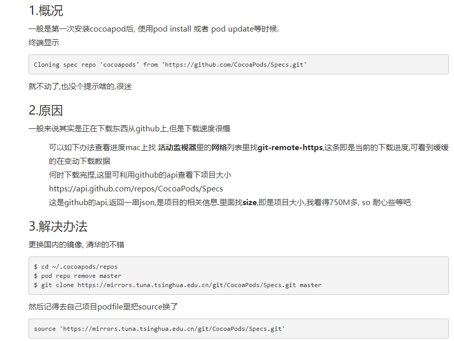
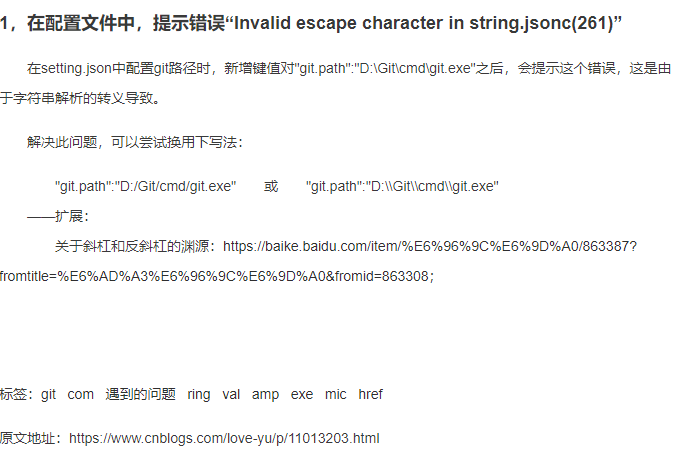
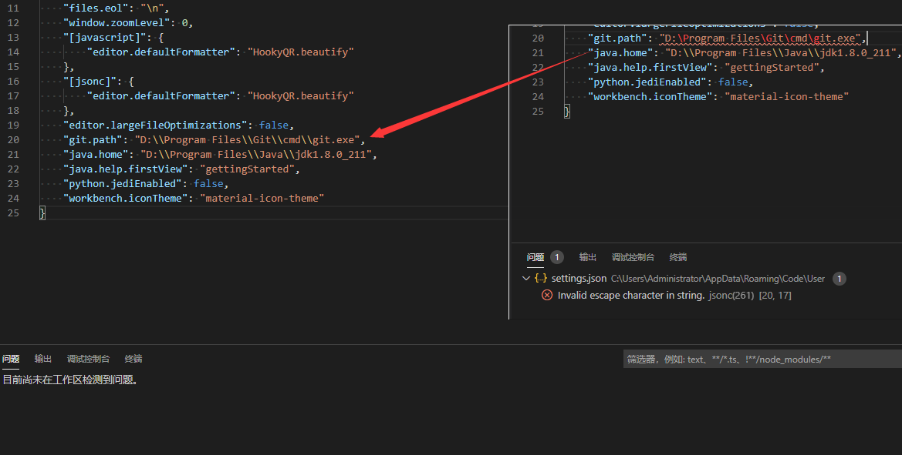
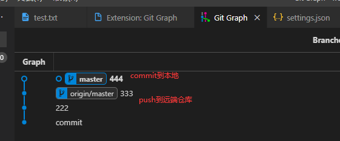
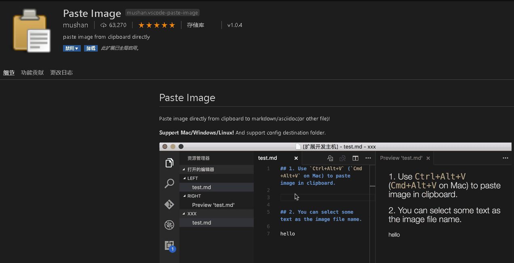
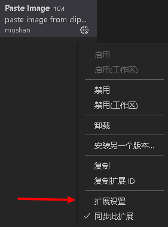
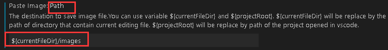
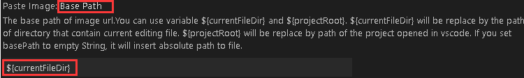
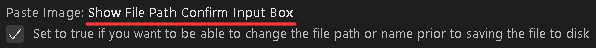

# 帧率方差

1) Avg(FPS):平均帧率(一段时间内平均FPS)

2) Var(FPS):帧率方差(一段时间内FPS方差)

方差：

方差是各个数据与平均数bai之差的平du方的平均数。
S^zhi2=[(X1-X¯)^2+(X2-X¯)^2+……+(Xn-X¯)^2]/N
S^2=1/N*Σ(Xn-X¯)^2
举例：
1，dao2，3，4，5，6，7
平均值：4
方差：[(1-4)^2+(2-4)^2+(3-4)^2+(4-4)^2+(5-4)^2+(6-4)^2+(7-4)^2]/7=4

    方差越大意味着帧率波动越大，游戏越卡

    决定是否流畅的因素是理论单帧耗时与实际单帧耗时是否匹配以及帧率方差（iQOO Neo3的帧率方差为2，新款iPhone SE的帧率方差为25.5，方差越大意味着帧率波动越大，游戏越卡）。

    相同模式下，iQQO Neo3的平均帧率为59.8FPS，看起来比新款iPhone SE多不了多少，但方差只有0.4，远远低于新款iPhone SE的25.5。另外，高于55FPS画面的时间占比，iQQO Neo3有99.9%，新款iPhone SE只有90.9%。因此，在帧率稳定性方面iQQO Neo3强于新款iPhone SE不是一星半点，同等模式下前者也比后者顺畅太多。

# VSCode下编写Markdown之插入图片插件Paste Image 
直接在VSCode的插件栏搜索关键字：Paste Image

扩张设置

主要修改的位置：
- 增加images目录【需在项目下新建images目录，方便存储图片】

- 设置为当前文件路径

- 推荐开启，方便自定义图片名称
